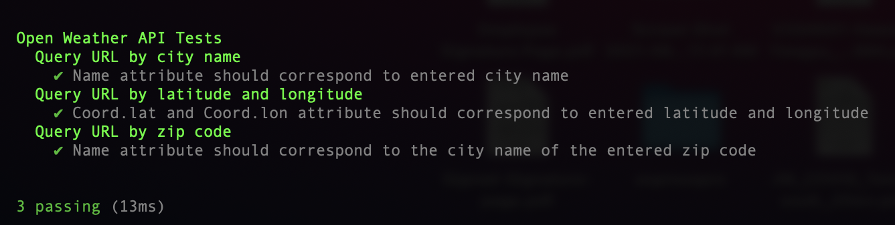

### **Prerequisite**
1. Have node installed on local machine
2. Run `npm install mocha` to install mocha library
3. Run `npm install chai` to install chai library 
4. Run `npm install chai-http` to install chai-http library

### **Instruction to Run**
1. In the root directory of the project, run following command to execute tests: `./node_modules/mocha/bin/mocha tests/test.js`  
2. Once tests are executed, a report below will be generated in terminal

3. If user wants to have report saved in a file, run following command instead: `./node_modules/mocha/bin/mocha tests/test.js > report`
 and a report file will be created inside directory with the report seen above